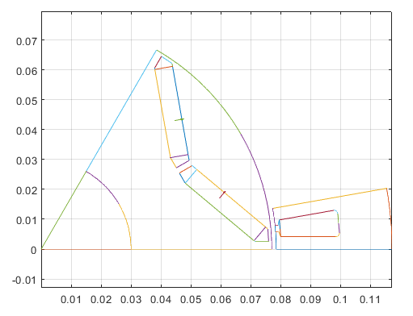

# EMDtool briefly

So, are you wondering how EMDtool works in practice? After reading this page you'll have an idea.

## Analysis workflow

A typical analysis workflow is described below.

### Creating a model

#### Dimensions and parameters for Geometry Templates

First of all, you'll be using *geometry templates* the majority of the time. A geometry template is a ´Matlab class´, representing a parametric component of your model. For instance, the [Stator](../api/Stator.html)
is a rather general-purpose template of a slotted stator. And, the [SPM1](../api/SPM1.html) template represents a surface-PM rotor with or without a rotor retaining sleeve, eddy-current shield, regular or Halbach
array magnets, segmented magnets, arced or regular magnet faces, and so forth.

In other words, there's no beating a good template in terms of ease of use, or code reusability for that matter. `EMDtool` already offers a quite decent selection of templates, and creating your own
is not such a formidable task once you get the hang of it. Besides, the initial investment of time here quickly pays itself back.

Anyways, creating a templated model is simple. You simply create a [`struct`](www.mathworks.com/help/matlab/ref/struct.html), and assign into it (as `fields`) the parameters and dimensions required. These typically include

* stator and rotor temperature (`.temperature_stator` and `.temperature_rotor`) respectively. In the future, it might be possible to change these later on, but for now they are simple hardcoded dimensions
specified in advance

* stack length `.leff`

* Any other geometric dimensions (think number of pole-pairs, stator OD and ID, rotor magnet pitch)

* Materials used: either indices to default built-in materials, or custom [Material](../api/MaterialBase.html) objects either returned by say the [PMlibrary](../api/PMlibrary.html) 
or [SteelLibrary](../api/SteelLibrary.html) classes or custom-made by you.

* Specifications for polyphase circuits: such as number of turns, layers, parallel paths, phases, etc... A [winding specification class](../api/PolyphaseWindingSpec.html) is what you'll need here.

#### Creating the geometries

Once you have the dimensions set (say in a structure called `dim`), you'll instantiate your geometry templates. Typically, you'll also visualize them to make sure everything is working correctly.

Here's how it can look like - code and plot directly from the EMDtool examples:

```matlab
stator = Stator(dim);
rotor = VIPM1(dim);

%plotting geometries
figure(1); clf; hold on; box on; axis equal;
stator.plot_geometry();
rotor.plot_geometry();
```



